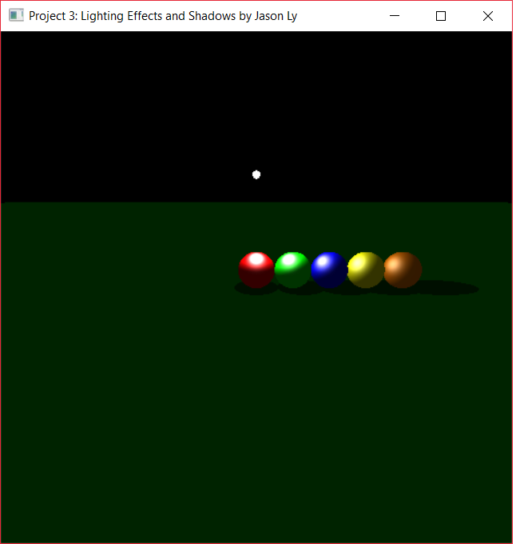
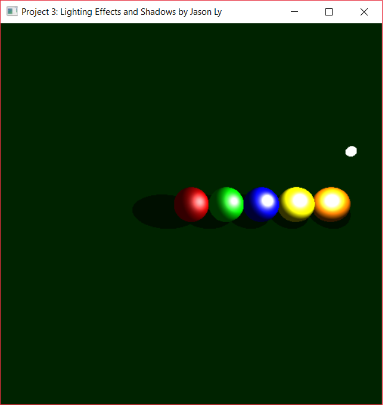
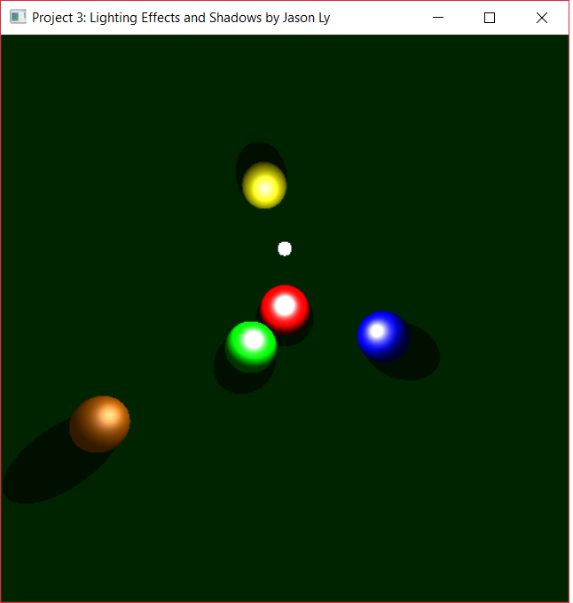

# Billiard_OpenGL_Fall2017

## Lighting Effects and Shadows
Program was executed in Visual Studio 2017 on Windows 10.

### Keyboard Controls
Lowercase decreases the value and uppercase increases the value
#### Move Eye Point
- **t/T** - Adjust theta
- **p/P** - Adjust phi
- **r/R** - Adjust radius
#### Move Light Point
- **x/X** - Adjust X position
- **y/Y** - Adjust Y position
- **z/Z** - Adjust Z position
#### Other
- **q** - Terminate program
- **Spacebar** - Start/Pause animation

### Screenshot of Results

